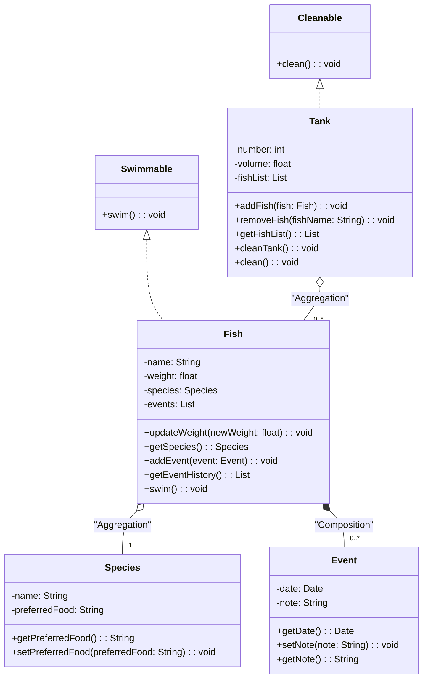

# 🎓 Interactive UML Teaching Framework

<div align="center">


<p align="center">
  <i>A dual-approach framework for teaching object-oriented design through interactive UML class diagrams</i>
</p>

</div>

## 📊 Framework Demo

<div align="center">
  <table>
    <tr>
      <td align="center" width="50%">
        
        <br>
        <em>Code-to-Diagram Generation</em>
      </td>
      <td align="center" width="50%">
        
        <br>
        <em>CodeWorkbench Schema Extraction</em>
      </td>
    </tr>
    <tr>
      <td align="center" width="50%">
        
        <br>
        <em>Interactive Control Panel</em>
      </td>
      <td align="center" width="50%">
        
        <br>
        <em>Dynamic UML Visualization</em>
      </td>
    </tr>
    <tr>
      <td align="center" colspan="2">
        
        <br>
        <em>Interactive Problem Description</em>
      </td>
    </tr>
  </table>
</div>

## 🚀 Overview

This project implements an innovative educational framework designed to teach object-oriented design principles through interactive UML class diagrams. The framework bridges theoretical concepts with practical implementation through two complementary approaches:

- **Code-Based Generation**: Automatically transforms Java/Python code into UML diagrams, allowing students to visualize their implementations
- **Direct Diagram Manipulation**: Enables building diagrams by interacting with highlighted terms in problem descriptions, reinforcing conceptual understanding

By combining these approaches, the framework provides a comprehensive learning experience that accommodates different learning styles and reinforces the connection between visual design and code implementation.

## ✨ Key Features

### 📝 Interactive Learning Experience
- **Term Highlighting**: Click on highlighted terms in problem descriptions to add diagram elements
- **Bi-directional Workflow**: Move seamlessly between code and diagram representations
- **Real-time Feedback**: Immediate assessment against reference solutions
- **Design Requirements Integration**: Interactive display of requirements alongside UML diagrams

### 🛠️ Advanced UML Tools
- **Relationship Management**: Intuitive interface for creating and modifying relationships
  <div align="center">
    
    <br>
    <em>Comprehensive Relationship Management Panel</em>
  </div>

- **Design Validation**: Automated checking of UML diagrams against specified requirements
  <div align="center">
    
    <br>
    <em>Interactive Design Requirements Panel</em>
  </div>

- **Requirement Tracking**: Visual indication of satisfied and unsatisfied requirements
  <div align="center">
    
    <br>
    <em>Extended Requirements Tracking System</em>
  </div>

### 💻 Technical Capabilities
- **Intelligent Code Parsing**: Extracts classes, methods, attributes, and relationships from source code
- **Schema Generation**: Creates UML schemas from parsed code structures
- **Pan & Zoom Navigation**: Intuitive diagram exploration with zoom capabilities
- **History Tracking**: Undo/redo functionality for diagram manipulations
- **Export Options**: Save diagrams as images or Mermaid markdown

## 🧩 Framework Architecture

### Frontend (React)
- **MermaidDiagram**: Core component for rendering and manipulating UML diagrams
- **CodeWorkbench**: Interface for writing, parsing, and validating code
- **RelationshipManager**: Tool for creating and editing relationships between entities
- **RequirementsPanel**: Interactive checklist of design requirements
- **EntityManager**: Interface for creating and modifying UML entities

### Backend (Flask)
- **Code Parsing API**: Processes Java and Python code
- **Assessment Engine**: Evaluates diagrams against reference solutions
- **Question Management**: Handles storage and retrieval of exercises
- **Submission Handling**: Records and evaluates student submissions

## 💡 Educational Applications

### Learning Objectives
- Understand object-oriented concepts (classes, interfaces, inheritance, etc.)
- Visualize relationships between classes
- Translate between code and visual representations
- Apply design patterns to solve problems
- Evaluate design alternatives against requirements

### Usage Scenarios
- **In-Class Demonstrations**: Instructors can use the tool to visually explain OO concepts
- **Interactive Assignments**: Students can complete UML design tasks with immediate feedback
- **Flipped Classroom**: Students can explore concepts independently before discussion
- **Assessment**: Automated evaluation of student understanding of OO design principles

## 📋 Getting Started

> Note: This is a preliminary guide. A comprehensive setup guide will be available when the project reaches beta status.

### Prerequisites
- Node.js (v14+)
- Python (v3.8+)
- Flask
- React

### Installation

```bash
# Clone the repository
git clone https://github.com/username/uml-teaching-framework.git

# Navigate to project directory
cd Thesis/research/mermaid-project

# Install dependencies
npm install

# Set up Python environment
python -m venv venv
source venv/bin/activate  # On Windows: venv\Scripts\activate
pip install -r requirements.txt

# Start the development server
npm start

# In a separate terminal, start the Flask backend
python server.py
```

## 🏛️ Project Structure

```
Thesis/
└── research/
    └── mermaid-project/
        ├── node_modules/            # Node.js dependencies
        ├── public/                  # Static files
        ├── src/
        │   ├── components/
        │   │   ├── containers/      # Container components
        │   │   ├── entityManager/   # Entity management tools
        │   │   ├── mermaidDiagram/  # UML diagram rendering
        │   │   ├── methods/         # Method handling
        │   │   ├── monacoWrapper/   # Code editor integration
        │   │   ├── questionSetup/   # Question configuration
        │   │   ├── relationshipManager/ # Relationship tools
        │   │   ├── ui/              # UI components
        │   │   └── xgrading/        # Grading system
        │   │       ├── instance/        # Instance management
        │   │       ├── migrations/      # Data migrations
        │   │       ├── Questions/       # Question database
        │   │       │   ├── Autoshop/    # Example questions
        │   │       │   ├── Banks/       # Example questions
        │   │       │   ├── Fish Store/  # Example questions
        │   │       │   │   └── question.html
        │   │       │   └── University/  # Example questions
        │   │       └── Submissions/     # Student submissions
        │   │           ├── Autoshop/
        │   │           ├── Fish Store/
        │   │           │   ├── Fish_Store_1741371805.json
        │   │           │   └── Fish_Store_1741374032.json
        │   │           └── University/
        │   ├── utils/
        │   │   ├── CodeWorkbench.js     # Code parsing tools
        │   │   ├── MermaidDiagramUtils.js  # Diagram utilities
        │   │   ├── mermaidUtils.js      # Mermaid integration
        │   │   ├── Popup.js             # Popup dialog utilities
        │   │   ├── popupUtils.js        # Popup helper functions
        │   │   └── usePopup.js          # Popup hooks
        │   ├── App.css
        │   ├── App.js                   # Main application component
        │   ├── index.css
        │   ├── index.js                 # Application entry point
        │   └── theme.js                 # Styling theme
        ├── server.js                    # Backend server
        ├── server.py                    # Python API server
        ├── package.json                 # Project dependencies
        └── package-lock.json            # Dependency lock file
```

## 📝 Example Usage: Fish Store UML Exercise

The framework includes a sample exercise to design a fish store management system:

<div align="center">
  
</div>

### Sample Design Requirements:
- Create `Tank` class implementing `Cleanable` interface
- Create `Fish` class implementing `Swimmable` interface
- Establish aggregation relationship between `Tank` and `Fish`
- Establish aggregation relationship between `Fish` and `Species`
- Establish composition relationship between `Fish` and `Event`

### Sample UML Solution:


## 🧪 Running Tests

```bash
# Run frontend tests
npm test

# Run backend tests
pytest

# Start development environment
npm start
```

## 📊 Research Applications

This framework is being developed as part of a thesis project at Western Kentucky University, investigating effective methods for teaching object-oriented design concepts. The project explores:

- Cognitive load reduction through dual-modality learning
- Knowledge transfer between visual and textual representations
- Effectiveness of interactive versus static learning materials
- Impact of immediate feedback on learning outcomes

## 🙏 Acknowledgments

- Built on the [Mermaid](https://github.com/mermaid-js/mermaid) diagramming framework by Knut Sveidqvist
- Inspired by research in computer science education and cognitive load theory
- Thanks to Western Kentucky University for supporting this research

## 👥 Contributors

- **Faculty Advisor**: Dr. Xing Guangming
- **Department**: Computer Science, Western Kentucky University

<div align="center">
  <b>⭐ Project Status</b>: Under active development as part of a thesis at Western Kentucky University
  <br>
  <small>Last Updated: March 2025</small>
</div>
